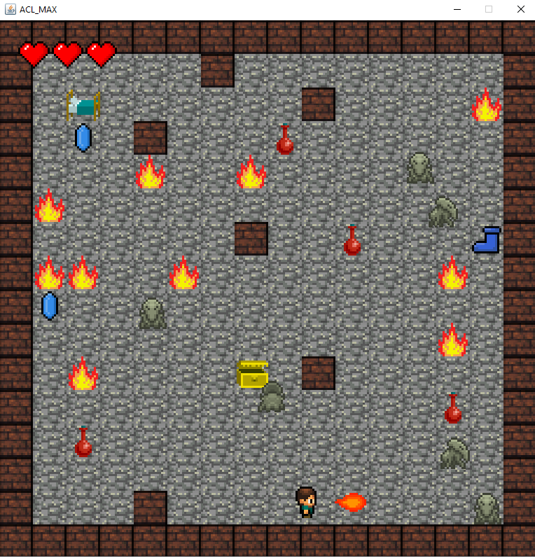

# Balade dans un labyrinthe

L’objectif de ce projet est la réalisation d’un jeu mono-utilisateur avec une interface 
graphique. Le jeu consiste à déplacer un personnage dans un labyrinthe dans le but de 
découvrir un trésor. Dans le labyrinthe il peut y avoir des monstres de différents types qui 
essayent d’attaquer le personnage

# Réalisé Par :  ACL-2A-UL-MAX
| BRINI Walid |  BEN HAMAD Moemen |  CHAIB Khaoula | DEROUICH Othmene |
ISN 2N

  

# Build 
`cd Code/game`

`mvn clean package`

# Run 
`java -jar target/game-1.0-SNAPSHOT.jar`

